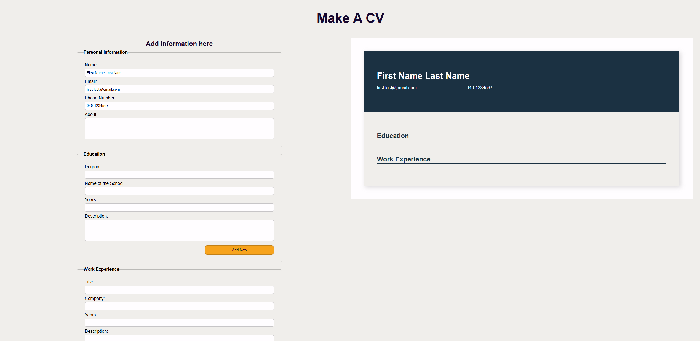
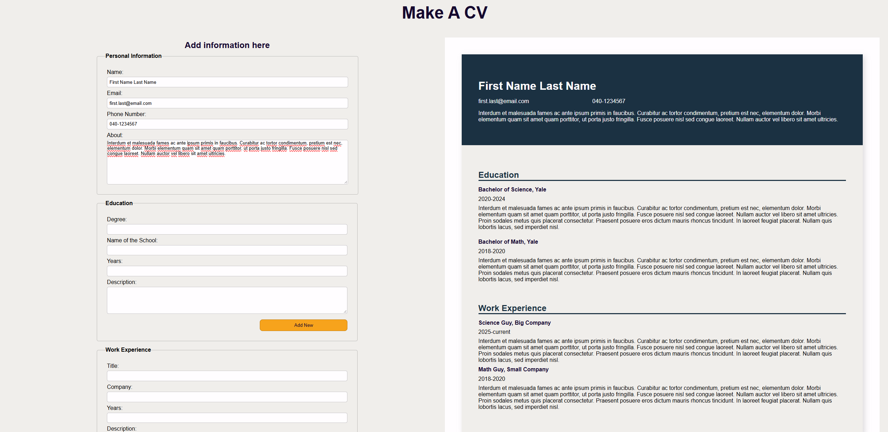

# CV Application

A CV Application built with React, featuring personal information, education and work experience fields to user to fill.

[Deployed site here](https://cv-application-lozukka.netlify.app/)

## Features

- Fill in fields: personal information, education and work experience
- Add new: add multiple education and work experiences
- Clear all: start over with a clear form and empty CV

## Built with

- React
- HTML & CSS
- Netlify (deployment)
- Claude AI

## What I learned

This project was part of [The Odin Project](https://www.theodinproject.com/) curriculum. Here are the key things I learned along the way:

### Lifting state up

The form and preview both need the same data, so state has to live in a shared parent and flow down as props.

### Controlled inputs and the spread pattern

Updating one field of an object in state means spreading the old object and overwriting just the changed key.

### Computed property names for generic handlers

Writing one handleChange function for every input in a form relies on [name]: value to use the value of the name variable as the object key, not the literal string "name". And it decreased the copy-pasting

### Silent bugs from name/key mismatches

An input's name attribute has to exactly match the corresponding state key, or a generic change handler will silently create an unrelated key instead of updating the right field — no error is thrown, the field just stops working. This came up more than once (tel vs phoneNumber, and a state field accidentally named workExperience instead of workDescription).

### Array state vs. object state

Education and Work Experience needed a different pattern than Personal Info: each is a list of entries, so adding one means spreading the array ([...list, newEntry]) rather than mutating it with .push(), which returns a length, not a new array, and doesn't reliably trigger a re-render.

### Rendering lists with .map() and key

Turning an array of entries into JSX means .map()-ing over it and giving each rendered item a key prop so React can track them across re-renders. Used array index as the key here, with the caveat that it can cause issues later if entries are ever deleted or reordered — a stable unique id would be more robust for that case.

### Naming collisions between singular and plural

Naming a list education and a single entry inside its own component education too creates a shadowing conflict — solved by naming the list educationExperience to keep the collection and the single-item name distinct.

### HTML details that matter in forms

Buttons inside a <form> default to type="submit" and will try to submit (and likely reload the page) unless explicitly set to type="button"

<legend> is only valid as the first child of a <fieldset>, not floating loose in a form

## Acknowledgements

Built as part of the [React course](https://www.theodinproject.com/paths/full-stack-javascript/courses/react) on The Odin Project.

## How I used AI

I used Claude AI throughout this project. It helped me understand theory and explained concepts I was encountering for the first time. It reviewed my code and gave feedback on how to improve it to a more professional level. Claude also generated the initial draft of this README based on our conversations during the project.
